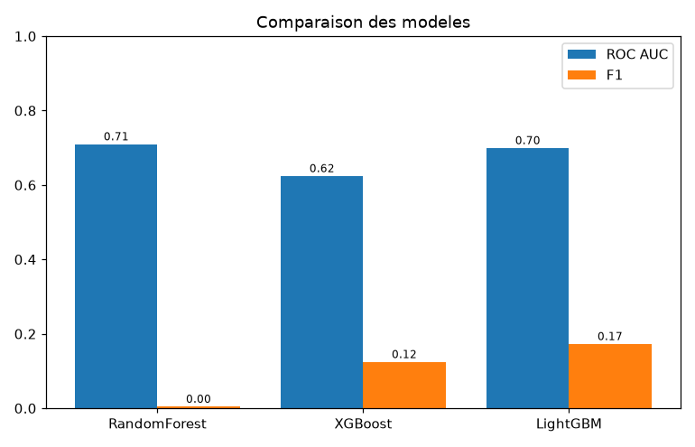
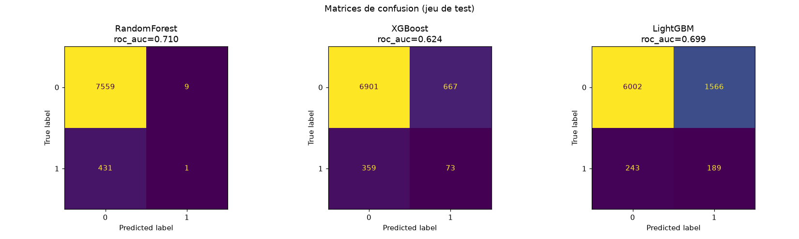

# Détection de fraude bancaire — Projet MLOps

Pipeline MLOps de **classification binaire** appliqué à la détection de transactions
bancaires frauduleuses (projet du module d'orchestration Machine Learning, ESGI / IABD).

## Problématique

À partir des caractéristiques d'une transaction bancaire (montant, pays, type de marchand,
score de crédit, tentatives échouées, etc.), prédire si elle est **frauduleuse** (`1`) ou
**légitime** (`0`).

- Les `1` = transactions frauduleuses à détecter et bloquer.
- Les `0` = transactions normales.
- Enjeu métier : limiter la fraude tout en évitant de bloquer à tort les clients.

> Le jeu de données est **déséquilibré** (~5,5 % de fraude). La métrique suivie en priorité
> est donc le `roc_auc` plutôt que l'`accuracy`.

## Jeu de données

[Bank Transaction Fraud Detection Dataset](https://www.kaggle.com/datasets/nafiulislam490/bank-transaction-fraud-detection-dataset)
(Kaggle, synthétique, 1 000 000 transactions, licence CC0). Cible : `is_fraud`.

Colonnes **exclues** des features (pour éviter la fuite de données et le bruit) :
`transaction_id`, `customer_id` (identifiants), `transaction_date`, `transaction_time`
(bruts), `city` (cardinalité trop élevée) et `fraud_type` (n'existe que si la transaction
est déjà une fraude → fuite de cible).

## Stack technique

- Python 3.13, environnement géré par **uv** (`pyproject.toml` + `uv.lock`)
- scikit-learn, XGBoost, LightGBM pour les modèles
- MLflow (tracking + Model Registry), Optuna (optimisation), SHAP (explicabilité)
- FastAPI + uvicorn (API d'inférence), Streamlit (frontend de test)
- Docker / docker-compose, Airflow (orchestration), GitHub Actions (CI/CD)

## Installation

### 1. Environnement Python

L'environnement est géré par [uv](https://docs.astral.sh/uv/) à partir du `pyproject.toml`
(Python 3.13). Pour créer le venv et installer les dépendances :

```bash
uv sync --extra dev      # crée .venv et installe le projet + les outils de dev
```

### 2. Récupérer le jeu de données

Le CSV (~147 Mo) n'est pas versionné. Il se télécharge via l'API Kaggle, qui demande un
token personnel.

1. Générer un token Kaggle : kaggle.com → photo de profil → **Settings** → **API** →
   *Create New Token* (télécharge un fichier `kaggle.json`).

2. Placer le `kaggle.json` dans le dossier personnel `~/.kaggle/` :
   ```bash
   mkdir -p ~/.kaggle
   mv ~/Downloads/kaggle.json ~/.kaggle/kaggle.json   # depuis WSL : /mnt/c/Users/<user>/Downloads/
   chmod 600 ~/.kaggle/kaggle.json
   ```
   (`~` = le dossier personnel ; dans WSL : `/home/<user>/`. Le `chmod 600` est exigé par le
   CLI Kaggle.)

3. Télécharger le dataset :
   ```bash
   make data        # ou : bash scripts/get_dataset.sh
   ```
   Le dataset arrive dans `data/raw/bank_fraud.csv`.

> Le token Kaggle est personnel : chaque utilisateur place le sien dans son propre
> `~/.kaggle/` et utilise le même script.

## Modélisation et suivi MLflow

Trois familles de modèles sont comparées : **RandomForest**, **XGBoost**, **LightGBM**. Le
déséquilibre des classes est géré (`class_weight="balanced"`, `scale_pos_weight`) et la
métrique optimisée est le `roc_auc`.

Deux stratégies d'optimisation des hyperparamètres :

| Script | Méthode | Description |
|--------|---------|-------------|
| `src/mlproject/train.py` | aucune | baseline (régression logistique), point de référence |
| `src/mlproject/train_models.py` | **GridSearchCV** | recherche exhaustive sur une grille fixe |
| `src/mlproject/train_optuna.py` | **Optuna (TPE)** | recherche bayésienne, plus efficace |

Deux modules utilitaires partagés :
- `src/mlproject/tracking.py` : configuration MLflow (expérience, tags) et log du dataset.
- `src/mlproject/evaluation.py` : graphique d'importance SHAP loggé comme artefact.

Chaque modèle est suivi dans **MLflow** (backend SQLite `mlflow.db`) : hyperparamètres,
métriques, matrice de confusion, rapport de classification, importance SHAP. Le meilleur
modèle est enregistré dans le **Model Registry** sous `fraude-bancaire-classifier`.

### Pipeline (via Makefile)

```bash
make install          # 1. environnement + dépendances (uv)
make train            # 2. baseline (régression logistique)
make train-models     # 3. comparaison GridSearchCV + MLflow
make train-optuna     # 4. optimisation Optuna + MLflow
make mlflow           # 5. interface MLflow sur http://127.0.0.1:5000
```

> Dans l'interface MLflow, ouvrir l'expérience `fraude-bancaire` puis l'onglet
> **Training runs** (l'onglet *Overview/Usage* concerne les traces GenAI et reste vide).

### Résultats

Comparaison des modèles (échantillon de test) :



Matrices de confusion :



> Le `roc_auc` est la métrique de référence (données déséquilibrées). Optuna atteint
> `roc_auc ≈ 0.72`, au-dessus de la baseline (0.711). Les figures sont régénérables avec
> `uv run python scripts/make_report.py`.

## Servir le modèle (API FastAPI)

Le modèle entraîné (`models/model.joblib`) est exposé via une API FastAPI
(`src/mlproject/api.py`). Le schéma d'entrée `Features` reprend exactement les colonnes du
dataset (numériques + catégorielles).

Endpoints :
- `GET /health` : état du service et du modèle
- `POST /predict` : prédiction (classe `0/1` + probabilité de fraude)
- `GET /model-info` : version servie (variable d'environnement `MODEL_VERSION`)
- `GET /docs` : documentation interactive (Swagger)

```bash
make api                    # démarre l'API sur http://127.0.0.1:8000
make predict                # (autre terminal) envoie une transaction d'exemple
```

`scripts/predict.py` est un client de test : il envoie une transaction à `/predict` et
affiche le résultat. L'URL de l'API est configurable via la variable `API_URL`.

Exemple de réponse :

```json
{ "prediction": 1, "probability": 0.87 }
```

## Orchestration de la stack (docker-compose)

`docker-compose.yml` orchestre 4 services :

| Service | Rôle | Port |
|---|---|---|
| `mlflow` | serveur de suivi MLflow | 5000 |
| `train` | entraînement one-shot (profil `train`), écrit le modèle dans un volume partagé | — |
| `api` | API FastAPI d'inférence (lit le modèle du volume) | 8000 |
| `frontend` | interface Streamlit qui appelle l'API | 8501 |

Le modèle est partagé via le volume `models_data` : `train` y écrit `model.joblib`,
`api` le lit (en lecture seule). Le `frontend` attend que l'API soit saine
(`depends_on: condition: service_healthy`) et la joint par son nom de service (`http://api:8000`).

```bash
make docker-up        # build + démarre mlflow, api, frontend
make docker-run       # entraîne le modèle (service train, profil train)
make docker-down      # arrête la stack
```

- API : http://localhost:8000 (docs : `/docs`)
- Frontend : http://localhost:8501
- MLflow : http://localhost:5000

> Le service `train` lit les données via le montage `./data:/app/data:ro` et écrit le
> modèle dans le volume `models_data`. Lancer `make docker-run` **avant** d'utiliser l'API
> pour que `model.joblib` existe.

## Qualité et intégration continue (CI)

Le quality gate se lance en local et dans GitHub Actions avec **les mêmes commandes** :

```bash
make check      # lint (ruff) + types (mypy) + tests (pytest)
```

`.github/workflows/ci.yml` s'exécute à chaque **push** et **pull request** (+ déclenchement
manuel) et enchaîne deux jobs :

1. **quality** : `ruff`, `mypy`, `pytest` — échoue si l'un échoue.
2. **train** (`needs: quality`) : génère des données synthétiques, entraîne la baseline et
   publie `model.joblib` comme **artefact** téléchargeable (Continuous Training).

## Structure du projet

```
.
├── Makefile                  pipeline (install, train, mlflow, api, docker, check...)
├── pyproject.toml / uv.lock  dépendances + versions figées (Python 3.13, uv)
├── docker-compose.yml        stack mlflow + train + api + frontend
├── .github/workflows/ci.yml  intégration continue (quality gate + training)
├── docker/                   Dockerfile.train / Dockerfile.api / Dockerfile.frontend
├── frontend/app.py           interface Streamlit
├── scripts/                  get_dataset.sh, preview_data.py, make_report.py,
│                             make_sample_data.py, predict.py
├── src/mlproject/            config, data, features, train, train_models,
│                             train_optuna, evaluation, tracking, api
└── tests/                    tests pytest (pipeline + API)
```

## Commandes principales (Makefile)

```bash
make install        # environnement + dépendances
make data           # télécharge le dataset Kaggle
make train          # baseline
make train-models   # comparaison GridSearchCV + MLflow
make train-optuna   # optimisation Optuna + MLflow
make mlflow         # interface MLflow
make api            # API FastAPI
make frontend       # interface Streamlit
make docker-up      # stack docker-compose complète
make check          # lint + types + tests
```
